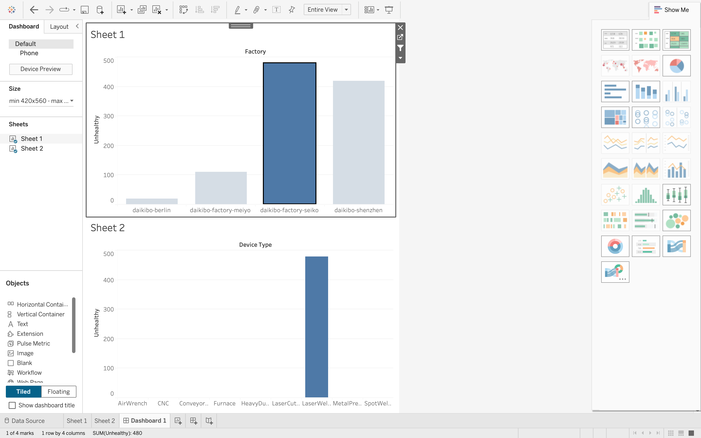

# Deloitte Data Analytics Virtual Internship

<p align="center">
  
  
  
</p>

<p align="center">
  <b>Excel | Tableau | Business Insights | Data Storytelling</b>
</p>

<p align="center">
Completed the Deloitte Data Analyst Virtual Internship by solving real-world business problems for Daikibo Industrials using Tableau, Excel, and business analytics.
</p>

---

# Project Overview

This repository contains two real-world Deloitte business case projects focused on:

## 📊 Factory Machine Downtime Analysis

and

## ⚖️ Gender Pay Equality Investigation

These projects demonstrate practical skills in:

* Data Analysis
* Tableau Dashboard Development
* Excel Classification Logic
* KPI Interpretation
* Business Recommendations
* Data Storytelling

---

# Project Structure

```text
Deloitte-Data-Analytics-Virtual-Internship
│
├── README.md
│
├── Task-1-Tableau-Telemetry-Analysis/
│   ├── tableau_dashboard.twbx
│   ├── dashboard_screenshot.png
│   ├── insights_summary.md
│   ├── Task 1 Guide.pdf
│   ├── Deloitte_Final_Report_Task1.pdf
│
├── Task-2-Excel-Gender-Pay-Equality/
│   ├── final_submission.xlsx
│   ├── findings_summary.md
│   ├── Deloitte_Final_Report_Task2.pdf
│
├── Certificates/
│   └── Deloitte_Virtual_Internship_Certificate.pdf
```

---

# Task 1 — Factory Telemetry Analysis (Tableau)

## 🎯 Business Problem

Daikibo Industrials collected telemetry data from 4 factories to identify machine downtime patterns.

The client wanted answers for:

1. Which factory had the highest machine downtime?

2. Which machine types caused the most downtime?

---

## 🛠 Tools Used

* Tableau
* JSON Data Analysis
* Dashboard Development
* KPI Reporting
* Data Visualization

---

## 📸 Dashboard Preview



---

## 🌐 Live Dashboard

View the interactive Tableau dashboard here:

[Click Here to Open Tableau Dashboard](https://public.tableau.com/views/tableau_dashboard_17770483101520/Dashboard1?:language=en-US&:sid=&:redirect=auth&:display_count=n&:origin=viz_share_link)

---

## 🔍 Key Findings

### ✅ Factory with Highest Downtime

Daikibo Factory Seiko

### ✅ Most Frequently Breaking Machine

Laser Welder

---

## 💡 Business Recommendation

Preventive maintenance should be prioritised for:

* Daikibo Factory Seiko
* Laser Welder machines

This helps reduce operational downtime and improve manufacturing efficiency.

Publishing the Tableau dashboard via Tableau Public improves recruiter accessibility and portfolio strength.

---

# Task 2 — Gender Pay Equality Analysis (Excel)

## 🎯 Business Problem

Daikibo Industrials received multiple complaints regarding gender-based salary inequality.

The goal was to classify Equality Scores and identify compensation fairness risks.

---

## ⚖️ Classification Categories

* Fair (±10)
* Unfair
* Highly Discriminative

---

## 🛠 Tools Used

* Microsoft Excel
* Formula Logic
* HR Data Analysis
* Business Classification

---

## 📌 Key Deliverable

Created a new classification column:

## Equality Class

to evaluate salary fairness across:

* factories
* job roles

---

## 💡 Business Recommendation

Highly discriminative roles should be reviewed immediately by HR leadership to improve compensation fairness and workplace trust.

This supports stronger compliance and better employee retention.

---

# 🚀 Skills Demonstrated

* Data Analysis
* Tableau Dashboard Development
* Excel Business Analysis
* Business Recommendations
* Dashboard Storytelling
* Data Cleaning
* KPI Interpretation
* Professional Reporting

---

# 🏆 Internship Certificate

Included in this repository for project validation and credibility.

---

# 👨‍💻 Author

## Pulkit Sharma

Aspiring Data Analyst

Excel | SQL | Tableau | Power BI | Python | Data Visualization
